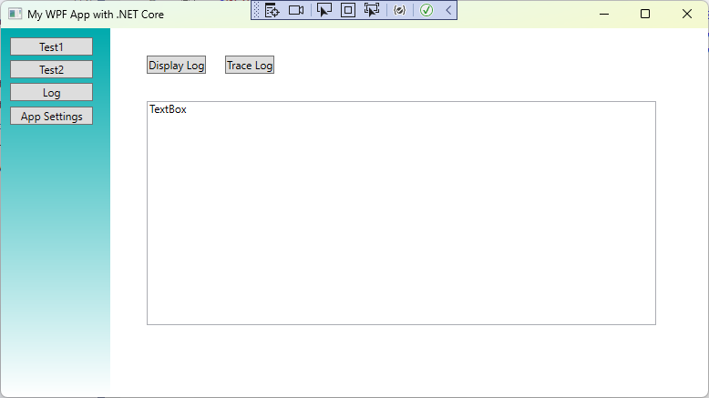
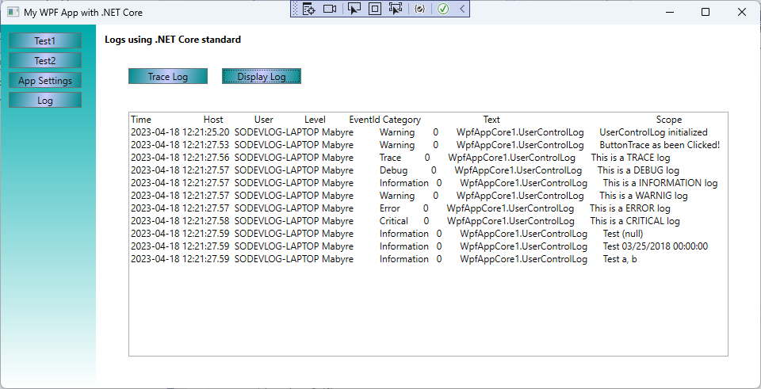
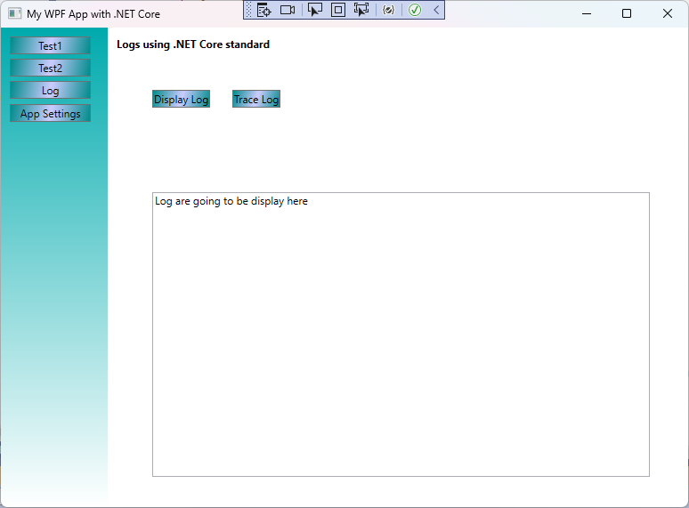
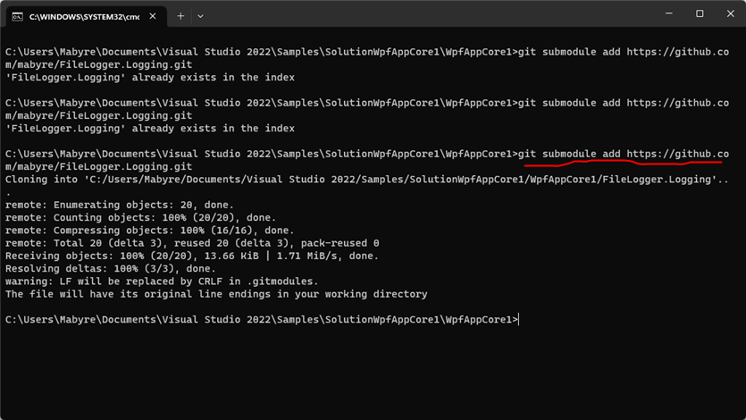

# WPF .NET Core ToolKit
This Toolkit let you rapidly add a new small test by adding a new UserControl and connect it to a new button on main window.

Like this:



## Summary
- [Personal logger](#Personal-logger)
- [Back to basics of Logs](#back-to-basics-of-logs)
- [Add an appsettings.json file](#add-an-appsettingsjson-file)
- [File Logger Provider](#file-logger-provider)
- [Create Style for toolbar](#create-style-for-toolbar)
- [Using Git Submodule](#using-git-submodule)

## UserControl1
- Use Logger Tool

## UserControl2 
- Demonstrate the use of ***Dependency Property***
- Show Style.Triggers

## UserControlLog
- .NET Core 6.0 way of produce Logs using .NET Core standard ***ILogger*** and ***ILoggerFactory***

## UseAppSettings
- Read application configuration in ***appsettings.json*** file

### Personal logger
It could be intresting to have it's own logger system at a time where everyone says to do not reinvent the wheel, while doing it.
Sometimes I could found ***log4net*** diffcult to install and configure.

## Tools/Logger
Loggin is a more tough subject than we can think, especially since log4net has become a gas factory.

Log message into severals, file, console, trace, windows easily add your own method.
Manage level of severity.

It's an exemple of using delegate function System.Action<T>

```csharp
    public static Action<string> WriteMessage;
```

Configuration is done in control after InitializeComponent : 

```csharp
    Logger.WriteMessage += LoggingMethods.LogToConsole; 
    Logger.WriteMessage += LoggingMethods.LogToTrace;
    Logger.LogLevel = Severity.Verbose; // by default set to Warning
```

- path to the log file :
	- WpfAppCore1\bin\Debug\netcoreapp3.1\log.txt

The use of this component have been demonstrated in a Blazor project: [MyBlazorServerApp](https://github.com/mabyre/MyBlazorServerApp)

#### ToDo
- complete logfile name with the date of the day
- format the login massage
- make user to specify log file path

## Back to basics of Logs
While I'm working on new apps, log is style a tricky subject. 
If I want to enhance my personnal logger I'll have some work. 
I saw something like adjust log level in appsettings could make you see internal core library messages and this is cool.

### Reference
- [StackOverflow - How to log to a file without using third party logger in .Net Core?](https://stackoverflow.com/questions/40073743/how-to-log-to-a-file-without-using-third-party-logger-in-net-core)
- [closed issue](https://github.com/aspnet/Logging/issues/441)
- [Logging in C# and .NET](https://learn.microsoft.com/en-us/dotnet/core/extensions/logging)
- [Logging and global error handling in .NET 7 WPF applications](https://blog.elmah.io/logging-and-global-error-handling-in-net-7-wpf-applications/)
- [Logging in .NET Core and ASP.NET Core](https://learn.microsoft.com/en-us/aspnet/core/fundamentals/logging/)
    - This is one for .NET Core particulary [Non-host console app](https://learn.microsoft.com/en-us/aspnet/core/fundamentals/logging/?view=aspnetcore-3.1#non-host-console-app) hard to find 
      but this code is not usefull teel appsettins.json file is present.

While I'm working on loggin features I found intresting to make logs in the ***.NET Core standard way***.

This is the aim of UserControlLog plus some little things like add ***Program.cs*** file in the project

```xaml
    <PackageReference Include="Microsoft.Extensions.Hosting" Version="8.0.0-preview.2.23128.3" />
    <PackageReference Include="Microsoft.Extensions.Logging" Version="8.0.0-preview.2.23128.3" />
```

## Add an appsettings.json file
I'm surprise that default template WPF application are NOT with an an appsettings.json file ?!
While WPF application create by TemplateSutio had one.

So add by hand an appsettings.json

### Reference
- [LearnMicrosoft - Configuration in ASP.NET Core](https://learn.microsoft.com/en-us/aspnet/core/fundamentals/configuration/)
- [StackOverflow - C# ConfigurationManager in .NET Core](https://stackoverflow.com/questions/71104843/c-sharp-configurationmanager-in-net-core)

The aim of adding an ***appsettings.json*** is to configure Log level.

Once the appsettings.jso file is here the following config will make logs at Trace level :

```json
    "Debug": {
        "LogLevel": {
        "Default": "Trace",
        "Microsoft": "Trace",
        "Microsoft.Hosting": "Trace"
        }
    }
```

> :warning: If you change setting in appsettings.json, to be apply choose "Generate solution" for the appsettnigs.json file to be copied in directory:
>
> ***WpfAppCore1\bin\Debug\net6.0-windows***

While you're in Debug mode. Don't forget to have, in your .csproj :

```xaml
    <ItemGroup>
        <None Update="appsettings.json">
	        <CopyToOutputDirectory>Always</CopyToOutputDirectory>
        </None>
    </ItemGroup>
```

## File Logger Provider
All this is to use or create a FileLoggerProvider through the ILogginBuilder to write logs in a file without using third party provider wich are to complex to configure.

Develop it's own personal FileLoggin, like in the project's first part, is not sustainable.

This project now integrate a FileLogger that cames from tbebekis with just a small adaptation to display the log file. 

### Reference
- [GitHub - tbebekis - AspNetCore-CustomLoggingProvider](https://github.com/tbebekis/AspNetCore-CustomLoggingProvider)

Add a TextBloc to display the log file:



That's the result the final result snif ;) that's what I wanted to do a console to display logs that are in a log file. 
This can be very useful for debugging in dantesque conditions.

## Create Style for Toolbar
It's needed to add a Style for ToolBar Text

> :warning: Trying to create Style in <Application.Resources> create an exception in MainWindow InitializeComponent();
>
> Style must be created in ***<Window.Resources>***

[Learn Microsoft - How to create a style for a control (WPF .NET)](https://learn.microsoft.com/en-us/dotnet/desktop/wpf/controls/how-to-create-apply-style)



## Using Git Submodule
It can be usefull to use a module while ***FileLogger.Logging*** could be used by several projects.

It's not possible to create a submodule by the UI of Visual Studio, you should use the command line.

I create the Repository: [mabyre/FileLogger.Logging](https://github.com/mabyre/FileLogger.Logging)

I deleted the project inside ***WpfAppCore1*** and use the command:

> $git submodule add https://github.com/mabyre/FileLogger.Logging.git



Then I have to add the project by hand, using right button on the solution then add existing project.

Then add a project reference from FileLogger.Logging to WpfAppCore1.

While the project is already in github everyhting is fine.

## Other Reference Pages 

[HTTP Login in ASP.NET Core](https://learn.microsoft.com/en-us/aspnet/core/fundamentals/http-logging/)

[How to Write a Custom Logging Provider in ASP.NET Core](https://www.codeproject.com/Articles/1556475/How-to-Write-a-Custom-Logging-Provider-in-ASP-NET)

[:arrow_up_small: Top of page](#wpf-net-core-toolkit)
